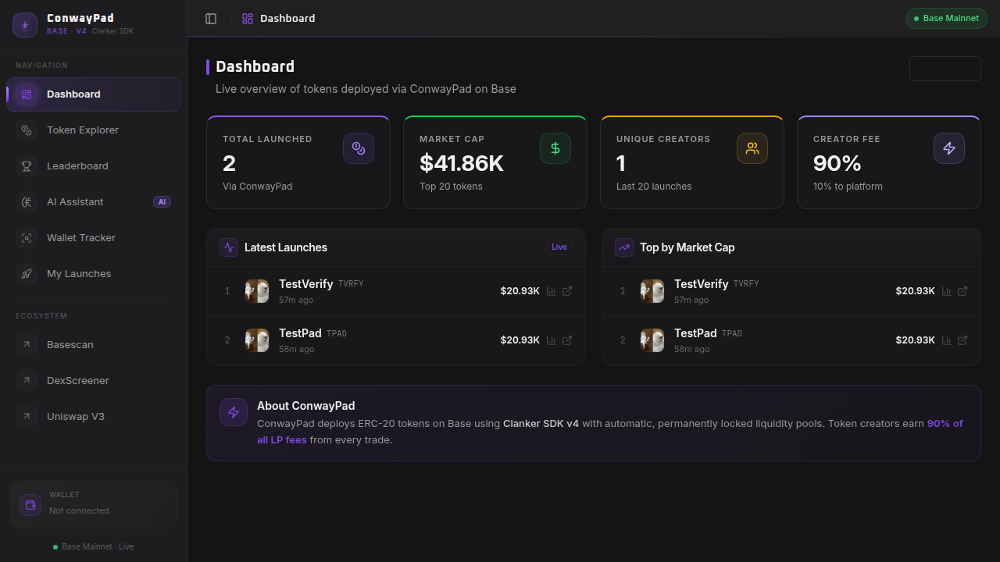
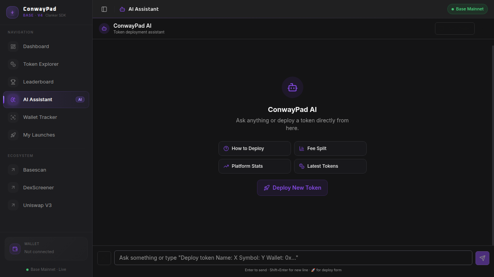

# ConwayPad — AI-Powered Token Launch Platform on Base

<div align="center">
  
  
  <br/>
  
  **Launch ERC-20 tokens on Base blockchain with AI assistance.**
  
  [](https://conwaypad.xyz)
  [](https://base.org)
  [](https://clanker.world)
  [](LICENSE)
</div>

---

## Screenshots

### Dashboard


### AI Chat Assistant


---

## Features

- **One-click token deployment** — deploy an ERC-20 token on Base with a single chat message
- **90/10 fee split** — 90% of Uniswap V3 LP fees go to the token creator, 10% to the platform
- **Permanently locked liquidity** — Uniswap V3 liquidity is locked at deploy time, protecting against rug pulls
- **AI chat assistant** — powered by `gpt-5-mini` via Conway's x402 pay-per-request protocol (USDC on Base)
- **Live dashboard** — real-time stats: total tokens, market cap, volume, leaderboard
- **Token Explorer** — browse all Clanker-deployed tokens on Base
- **Wallet Tracker** — track any wallet's token deployments
- **My Launches** — personal token management panel

---

## Tech Stack

| Layer | Technology |
|---|---|
| Frontend | React + TypeScript + Vite |
| Backend | Express.js + Node.js |
| Database | PostgreSQL (Drizzle ORM) |
| Blockchain | Base (Chain ID: 8453) |
| Token SDK | Clanker SDK v4 |
| DEX | Uniswap V3 |
| AI Inference | Conway x402 (`inference.conway.tech`) |
| Payment | USDC on Base (x402 protocol) |
| Styling | Tailwind CSS + shadcn/ui |

---

## Architecture

```
client/               # React frontend (Vite)
  src/
    pages/            # Dashboard, Chat, Token Explorer, Wallet Tracker, My Launches
    components/       # Shared UI components
    lib/
      conway.ts       # x402 payment + streaming AI client
      queryClient.ts  # TanStack Query setup

server/
  routes.ts           # Express API routes + Clanker deployment + Conway x402 AI
  storage.ts          # PostgreSQL storage interface

shared/
  schema.ts           # Drizzle ORM schema (TokenLaunch, TrackedWallet)
```

---

## How It Works

### Token Deployment

1. User sends a deploy request in the AI chat (or via the form)
2. The backend parses token parameters (name, symbol, wallet, etc.)
3. ConwayPad calls **Clanker SDK v4** from the agent wallet
4. Clanker deploys the ERC-20 contract and creates a **Uniswap V3 pool** on Base
5. The creator's wallet is set as `tokenAdmin` (receives 90% of LP fees)
6. Token appears on [DexScreener](https://dexscreener.com/base) and [clanker.world](https://clanker.world)

### AI Chat (Conway x402 Protocol)

Conway uses a **pay-per-request** model — each AI inference request is paid in USDC on Base:

1. Client sends a POST request to the AI endpoint
2. Conway API responds with `402 Payment Required` + payment details
3. The agent wallet signs a micro-payment (~$0.000048 per request)
4. Conway responds with a streaming AI completion
5. If x402 fails, the built-in knowledge base provides fallback answers

**Model:** `gpt-5-mini` at $0.000048/request  
**Agent wallet:** Funds ~120,000+ AI requests per USDC

---

## Environment Variables

| Variable | Description |
|---|---|
| `CONWAY_WALLET_PRIVATE_KEY` | Agent wallet private key (signs x402 payments + deploys tokens) |
| `SESSION_SECRET` | Express session secret |
| `DATABASE_URL` | PostgreSQL connection string |

---

## Key Addresses (Base Mainnet)

| Item | Address |
|---|---|
| Conway payTo | `0x21DD37E3E4eA6CCC0a5C98A4944702eDE6E7Be10` |
| USDC (Base) | `0x833589fCD6eDb6E08f4c7C32D4f71b54bdA02913` |
| Agent wallet | `0x9b13c1b7696E94123ec28033004235d1b7303BeA` |

---

## Conway x402 Endpoints

| Endpoint | Value |
|---|---|
| Base URL | `https://inference.conway.tech/v1` |
| Chat completions | `/chat/completions` |
| Models | `gpt-5-mini`, `gpt-5-nano`, `gpt-4.1-mini`, `claude-haiku-4.5` |

---

## Getting Started

```bash
# Install dependencies
npm install

# Push database schema
npm run db:push

# Start development server
npm run dev
```

Set your environment secrets:
```
CONWAY_WALLET_PRIVATE_KEY=0x...
SESSION_SECRET=your_secret
DATABASE_URL=postgresql://...
```

---

## Deploy a Token (Chat Format)

```
Deploy token
Name: My Token
Symbol: MTK
Website: https://mytoken.xyz
X: https://x.com/mytoken
Description: A token for my community
Wallet: 0xYourWalletAddress
```

**Required fields:** Name, Symbol, Wallet

---

## Fee Structure

- **Uniswap V3 swap fee:** 0.3% per trade
- **Creator share:** 90% of all LP fees → directly to your wallet
- **Platform share:** 10% of all LP fees → ConwayPad

Fees accumulate in the Uniswap V3 pool and can be claimed at any time via [clanker.world](https://clanker.world).

---

## License

MIT
